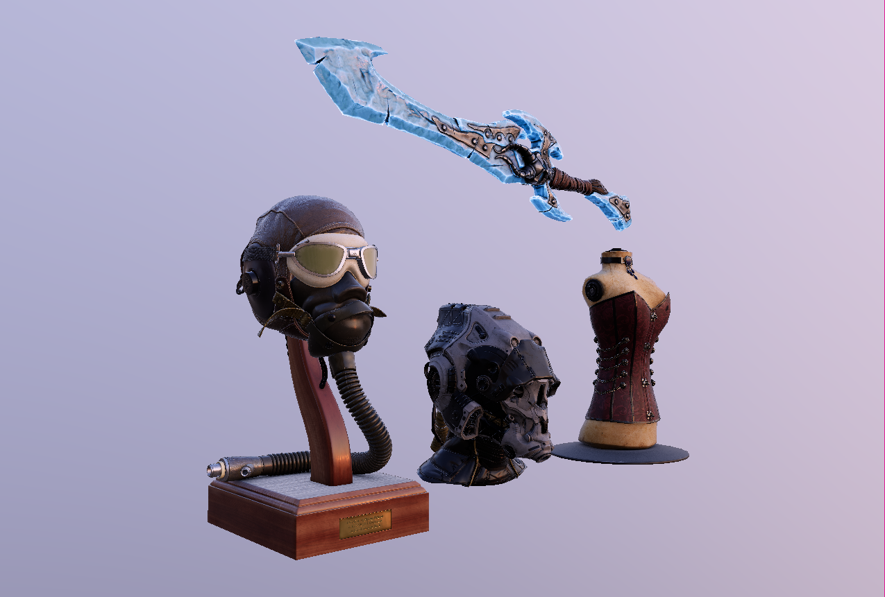
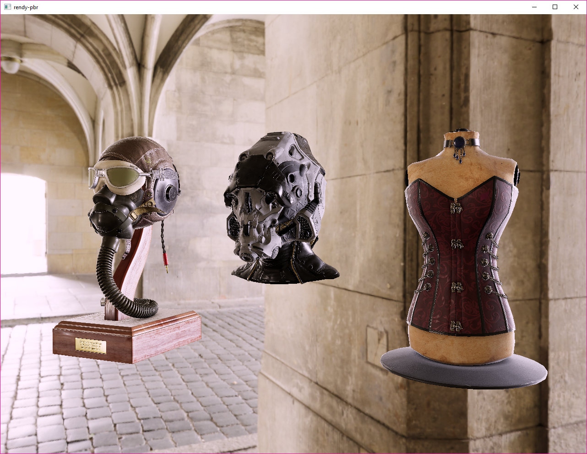
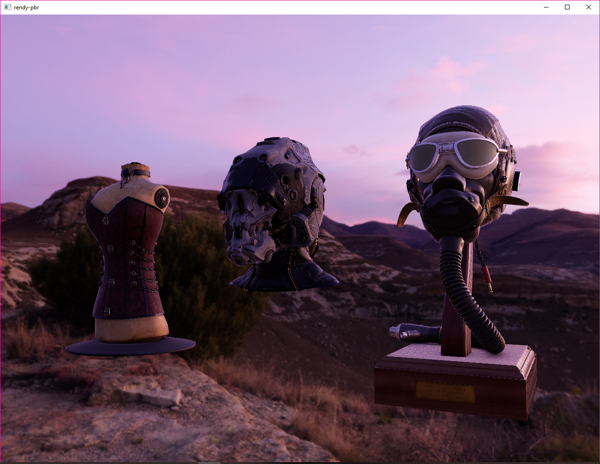
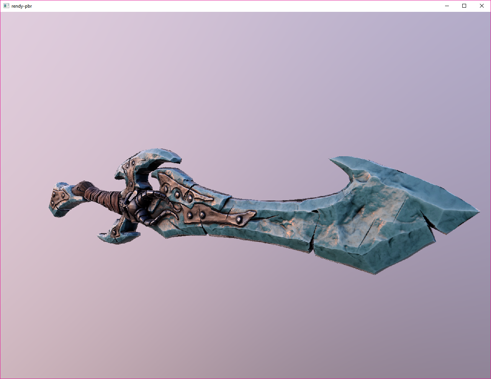
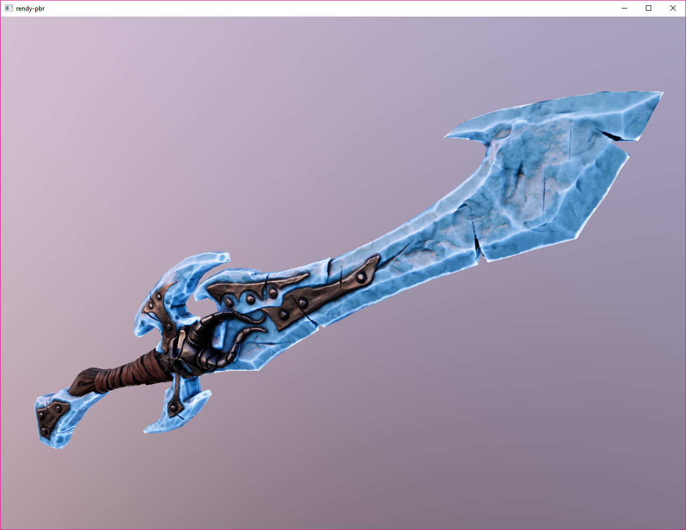

# `rendy-pbr`

This is a small, realtime physically-based renderer written with `rendy`, a 'make-your-own-renderer' toolkit
which builds on `gfx-hal` by providing a render graph, compile- and run-time safety checks, and
other helpers. It is a testbed for `rendy` and Amethyst; much or all of what is implemented here will eventually be added to the Amethyst renderer in some form.

## Planned features/next steps:

-   [x] Physically based shading model
-   [x] Point lights
-   [x] Basic `glTF` import
-   [x] HDR rendering with a tone mapping pass
-   [x] More robust `glTF` import
-   [x] Scene format for loading models from multiple glTF files
-   [x] Diffuse and specular image based lighting using split-sum approximation
-   [x] Emissive materials
-   [ ] Bloom
-   [ ] Time-Sampled Anti-aliasing
-   [ ] Postprocess color correction
-   [ ] Directional lights
-   [ ] Shadow mapping
-   [ ] (Maybe) Vertex skinning/animation

# Building

Building should straightforward, however there is a bit of extra complication compared to a standard Cargo project. First, this repo uses Git LFS to store demo asset files. This means that you need to install git-lfs before cloning the repo, or if you already have cloned it then install git lfs and do another pull, upon which you should download the necessary files.

Second, one of the dependencies, shaderc, is a little more complex to set up. See the [Setup](https://github.com/google/shaderc-rs#setup) section of the `shaderc-rs` repo for more information.

With that done, you should just be able to run

    cargo run --features <vulkan | metal> [--release]

## RenderDoc

If you want to inspect a frame in RenderDoc, there is support for RenderDoc built into the application under the `rd` feature flag. It only works with the Vulkan backend currently, so you'll need to be on either Windows or Linux. To use it, you must have `renderdoc.dll`/`renderdoc.so` on your `PATH`. On Windows, this just means adding the RenderDoc folder in Program Files to your path. Then build with:

    cargo run --features="vulkan rd" [--release]

# Scene Description

See `scene.rs` for a description of the scene format, and `assets/scene.ron` for an example. Should be able to load
data from any PBR metallic-roughness based glTF assets. If you encounter issues, please open a ticket in the issue
tracker!

# Controls

### Navigation

-   **Left click**: Rotate camera
-   **Middle click**: Pan camera
-   **Right click/Scroll wheel**: Dolly camera

\* _Note: for now model controls are disabled_

### ~~Model controls~~

-   ~~**X**: Add a row of models in the X direction~~
-   ~~**Y**: Add a row of models in the Y direction~~
-   ~~**Z**: Add a row of models in the Z direction~~

\* _Hold shift to subtract a row_

### Tonemapping/Exposure controls

-   **A**: Use ACES Tonemapping curve
-   **U**: Use Uncharted 2 Tonemapping curve
-   **C**: Display Uncharted 2 and ACES in split-screen configuration
-   **Hold CTRL + left click**: Adjust split screen split
-   **E**: Increase exposure f-stop (hold shift to decrease)

### Environment Mapping/Processed IBL Mapping Display Controls

-   **M**: View HDR environment map
-   **I**: View convoluted irradiance map
-   **S**: View convoluted specular radiance map
-   **S**: View rougher convolution of specular map
-   **Shift+S**: View smoother convolution of specular map

# More Screenshots

# Assets

FlightHelmet, SciFiHelmet, and Corset models are from the [glTF Samples repository](https://github.com/KhronosGroup/glTF-Sample-Models). FlightHelmet and Corset were originally created by Microsoft and are licensed under the public domain. SciFiHelmet was created by Michael Pavlovich for Quixel and is licensed under the CC-Attrib 4.0 license.

ElementalSword was created by [X-ray on Sketchfab](https://sketchfab.com/3d-models/elemental-sword-ice-a31a127d003e49abbe9645a62031729d) and is under the CC-Attrib-NonCommercial license.
