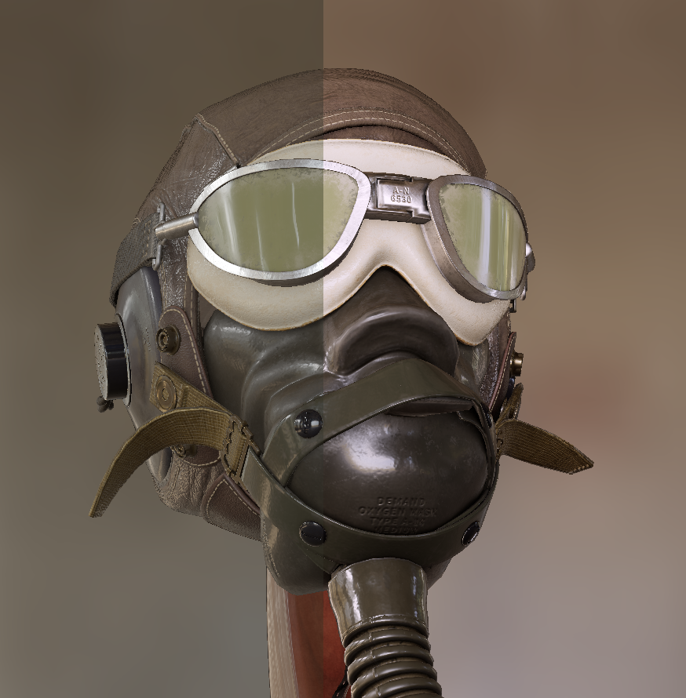
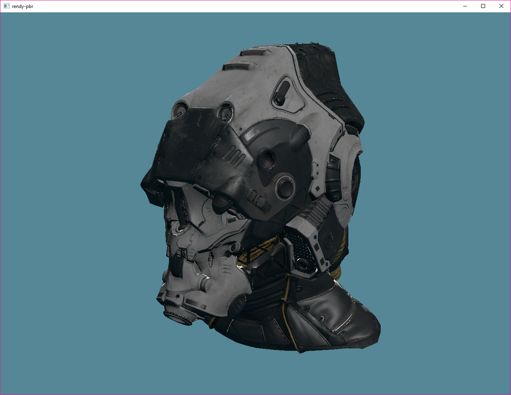

# `rendy-pbr`

This is a toy realtime physically-based renderer written with `rendy`, a 'make-your-own-renderer' toolkit
which builds on `gfx-hal` by providing a render graph, compile- and run-time safety checks, and
other helpers.

## Planned features/next steps:

* [x] Physically based shading model
* [x] Point lights
* [x] Basic `glTF` import
* [x] HDR rendering with a tone mapping pass
* [x] More robust `glTF` import
* [x] Scene format for loading models from multiple glTF files
* [ ] Diffuse and specular environment mapping
* [ ] Directional lights
* [ ] Shadow mapping

# Scene Description

See `scene.rs` for a description of the scene format, and `assets/scene.ron` for an example. Should be able to load
data from any PBR metallic-roughness based glTF assets. If you encounter issues, please open a ticket in the issue
tracker!

# Controls

### Navigation
* **Left click**: Rotate camera
* **Middle click**: Pan camera
* **Right click/Scroll wheel**: Dolly camera

\* *Note: for now these controls are disabled*
### ~~Model controls~~
* ~~**X**: Add a row of models in the X direction~~
* ~~**Y**: Add a row of models in the Y direction~~
* ~~**Z**: Add a row of models in the Z direction~~

\* *Hold shift to subtract a row*

### Tonemapping/Exposure controls
* **A**: Use ACES Tonemapping curve
* **U**: Use Uncharted 2 Tonemapping curve
* **C**: Display Uncharted 2 and ACES in split-screen configuration
* **Hold CTRL + left click**: Adjust split screen split
* **E**: Increase exposure f-stop (hold shift to decrease)

# Screenshots

