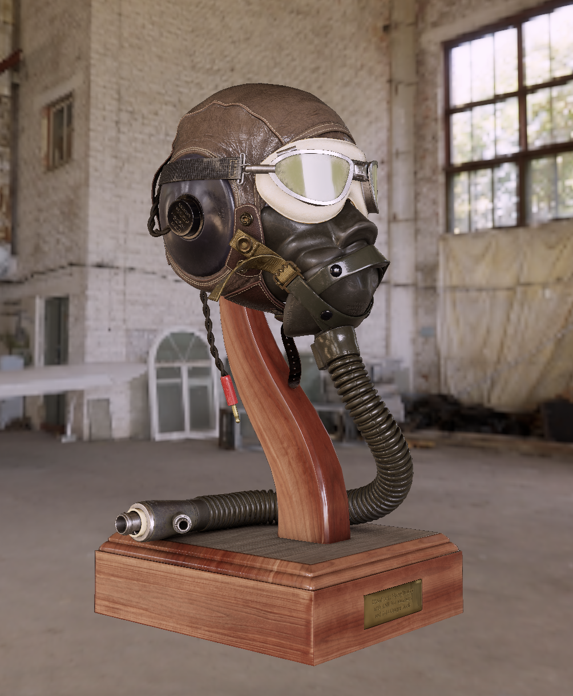

# `rendy-pbr`

This is a toy realtime physically-based renderer written with `rendy`, a 'make-your-own-renderer' toolkit
which builds on `gfx-hal` by providing a render graph, compile- and run-time safety checks, and
other helpers.

## Planned features/next steps:

* [x] Physically based shading model
* [x] Point lights
* [x] Basic `glTF` import
* [] HDR rendering with a tone mapping pass
* [] Diffuse and specular environment mapping
* [] Directional lights
* [] Shadow mapping
* [] More robust `glTF` import

# Screenshots

